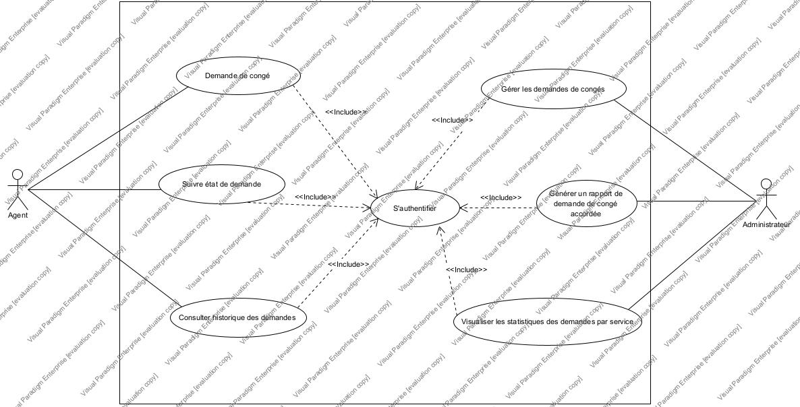

# Description

Le projet porte sur une application de gestion des congés administratifs et des demandes d'absence dans le ministère du plan et du développement.

Les agents des services du ministère doivent être capable de faire des demandes de congé ainsi que des demandes d'absence sur la plateforme. Il y a en tout 18 services différents.

Chaque agent a un solde de congé qui augmente de 30 jours chaque année et qui est de 0 pour la première année.

> Ça veut dire que si un agent prend du service le 01/01/2021, il ne pourra pas prendre de congés avant le 01/01/2022. Date à laquelle son solde de congés passera à 30 et il pourra prendre des congés s'il le souhaite. Le 01/01/2023, son solde sera de 30 jours plus son solde restant en 2022.

Il y a quatre types de demande : les congés administratifs, les congés de paternité, les congés de maternité et les absences.

- Les congés administratifs sont déductibles du solde de congé de l'agent
- Les congés de paternité sont de trois jours et ne sont pas déductibles du solde de congé
- Les congés de maternité sont de quatorze semaine (soit 6 semaines avant le jour prévu pour l'accouchement et 8 semaines après celui ci) et ne sont pas déductibles du solde de congé
- Les sont déductibles du solde de congé de l'agent.

À noter qu'un agent, quelque soit son solde, n'a droit qu'à 90 jours de congés au maximum dans une année et qu'il ne peut pas faire de demande de congé avant sa date d'ouverture du droit au congé (un an après sa prise de fonction)

Concernant les fonctionnalités à inclure dans l'application, il y a entre autres :

- la demande de congé ou d'absence par un agent
- le suivi de sa demande par un agent
- une consultation de son historique de demande
- la gestion (accord / refus) des demandes de congé ou d'absence par l'administrateur
- une génération d'une note de service récapitulant les informations des demandes accordées sur une période donnée
- une génération d'un titre de congé récapitulant les informations et les soldes de congé des agents d'un service donné

## Dictionnaire de données

Voici la représentation sous forme de tableau de chaque table de la base de données, avec les colonnes attributs, type, taille et description :

**Agent**

| Attribut                       | Type    | Taille | Description                                               |
| ------------------------------ | ------- | ------ | --------------------------------------------------------- |
| id                             | INT     |        | Clé primaire, identifiant unique de l'agent               |
| nom                            | VARCHAR | (255)  | Nom de l'agent                                            |
| prenoms                        | VARCHAR | (255)  | Prénoms de l'agent                                        |
| matricule                      | VARCHAR | (50)   | Matricule de l'agent                                      |
| fonction                       | VARCHAR | (255)  | Fonction de l'agent                                       |
| corps                          | VARCHAR | (255)  | Corps de l'agent                                          |
| id_structure                   | INT     |        | Clé étrangère vers la table Structure                     |
| date_prise_service             | DATE    |        | Date de prise de service de l'agent                       |
| solde_annee_actuelle           | INT     |        | Solde de congé pour l'année en cours de l'agent           |
| cumul_solde_annees_anterieures | INT     |        | Cumul du solde de congé des années précédentes de l'agent |
| email                          | VARCHAR | (80)   | Email pour la connexion de l'agent                        |
| password                       | VARCHAR | (255)  | Mot de passe pour la connexion de l'agent                 |

**Structure**

| Attribut     | Type    | Taille | Description                                         |
| ------------ | ------- | ------ | --------------------------------------------------- |
| id           | INT     |        | Clé primaire, identifiant unique de la structure    |
| sigle        | VARCHAR | (10)   | Sigle de la structure                               |
| denomination | VARCHAR | (255)  | Dénomination de la structure                        |
| id_directeur | INT     |        | Clé étrangère vers la table Agent (id du directeur) |

**Demande**

| Attribut     | Type    | Taille | Description                                        |
| ------------ | ------- | ------ | -------------------------------------------------- |
| id           | INT     |        | Clé primaire, identifiant unique de la demande     |
| id_agent     | INT     |        | Clé étrangère vers la table Agent                  |
| id_typeconge | INT     |        | Clé étrangère vers la table TypeDemande            |
| date_debut   | DATE    |        | Date de début de la demande                        |
| date_fin     | DATE    |        | Date de fin de la demande                          |
| statut       | VARCHAR | (50)   | Statut de la demande (pending, accepted, rejected) |

**TypeDemande**

| Attribut | Type    | Taille | Description                                         |
| -------- | ------- | ------ | --------------------------------------------------- |
| id       | INT     |        | Clé primaire, identifiant unique du type de demande |
| libelle  | VARCHAR | (255)  | Libellé du type de demande                          |

**NoteDeService**

| Attribut  | Type      | Taille | Description                              |
| --------- | --------- | ------ | ---------------------------------------- |
| id        | INT       |        | Clé primaire                             |
| periode   | DateRange | (255)  | Période concernée par la note de service |
| reference | VARCHAR   | (255)  | Référence de la note de service          |
| chemin    | VARCHAR   | (255)  | Chemin vers le document                  |

**TitreDeConge**

| Attribut  | Type    | Taille | Description                           |
| --------- | ------- | ------ | ------------------------------------- |
| id        | INT     |        | Clé primaire                          |
| annee     | INT     |        | Année concernée par le titre de congé |
| reference | VARCHAR | (255)  | Référence du titre de congé           |
| chemin    | VARCHAR | (255)  | Chemin vers le document               |

## Modélisation

### Cas d'utilisation

#### Acteurs

- **Agent** : L'agent est l'utilisateur principal du système. Il est responsable de la gestion de ses propres demandes de congé et d'absence. Cet acteur interagit avec le système pour effectuer des demandes, suivre leur statut et consulter son historique de demandes.

- **Directeur** : Le directeur est un agent ayant des privilèges supplémentaires par rapport aux simples agents. Il est responsable de la gestion des demandes de congé et d'absence dans le service qu'il dirige. Cet acteur interagit avec le système pour gérer les demandes, les approuver ou les rejeter.

- **Manager des ressources humaines** : Le manager des ressources humaines est également un agent avec des privilèges supplémentaires par rapport aux agents simples. Il est responsable de la génération des différents documents : la note de service concernant les demandes accordées sur une période donnée ainsi que le titre de congé au début de chaque année.

#### Cas d'utilisation

- **Faire une demande de congé** : Permet à un agent de soumettre une demande de congé, en fournissant les informations nécessaires telles que la date de départ, la durée, le type de congé, etc. Cette fonctionnalité permet à l'agent de demander un congé ou une absence.

- **Suivre l'état d'une demande** : Permet à un agent de suivre l'état de ses demandes de congé et d'absence, en vérifiant si elles sont en attente, approuvées ou rejetées. Cela permet à l'agent de connaître l'avancement de ses demandes et de planifier en conséquence.

- **Consulter l'historique des demandes** : Permet à un agent de consulter l'historique de ses demandes de congé et d'absence précédentes. Cela permet à l'agent de vérifier les congés accordés précédemment et de faire référence à ses demandes passées.

- **Gérer les demandes de congé (directeur)** : Permet à l'administrateur de gérer les demandes de congé soumises par les agents. Cela comprend la visualisation de toutes les demandes, l'approbation ou le rejet des demandes, ainsi que la mise à jour du statut des demandes.

- **Générer une note de service de demandes de congé accordées (manager des ressources humaines)** : Permet à l'administrateur de générer un rapport récapitulatif des demandes de congé approuvées. Ce rapport peut inclure des informations telles que les dates, les durées, les types de congé et les informations sur l'agent concerné.

- **Générer les titres de congé (manager des ressources humaines)** : Permet à l'administrateur de visualiser les statistiques globales des demandes de congé et d'absence par service. Cela peut inclure le nombre de demandes par service, les types de congé les plus courants, etc.

### Diagramme de classes

## Liste des tâches

### Mise en place des APIs

Liste logique et chronologique des APIs à mettre en place dans le cadre de l'application :

1. **Authentification et gestion des utilisateurs**

   | Method | URI          | Nom de la route | Action                           |
   | ------ | ------------ | --------------- | -------------------------------- |
   | POST   | api/register | register        | UserController@register          |
   | POST   | api/login    | login           | UserController@login             |
   | POST   | api/logout   | logout          | UserController@logout            |
   | GET    | api/user     | user            | UserController@getCurrentUser    |
   | PUT    | api/user     | user.update     | UserController@updateCurrentUser |
   | DELETE | api/user     | user.destroy    | UserController@deleteCurrentUser |

2. **Demandes de congé et d'absence**

   | Method | URI                    | Nom de la route  | Action                    |
   | ------ | ---------------------- | ---------------- | ------------------------- |
   | GET    | api/demandes           | demandes.index   | DemandeController@index   |
   | POST   | api/demandes           | demandes.store   | DemandeController@store   |
   | GET    | api/demandes/{demande} | demandes.show    | DemandeController@show    |
   | PUT    | api/demandes/{demande} | demandes.update  | DemandeController@update  |
   | DELETE | api/demandes/{demande} | demandes.destroy | DemandeController@destroy |

3. **Génération de documents**

   | Method | URI                          | Nom de la route          | Action                                   |
   | ------ | ---------------------------- | ------------------------ | ---------------------------------------- |
   | POST   | api/generate-note-de-service | generate.note-de-service | DocumentController@generateNoteDeService |
   | POST   | api/generate-titre-de-conge  | generate.titre-de-conge  | DocumentController@generateTitreDeConge  |

## Fonctionnalités principales de l'application

- Création d'une demande de congé ou d'absence
- Gestion des demandes
- Génération de documents
- Gestion des utilisateurs

## Interactions entre les utilisateurs et le système

- S'inscrire / se connecter au système
- Faire une demande de congé ou d'absence
- Suivre sa demande
- Consulter les rapports générés (notes de service, titre de congé)

- Consulter la liste des demandes
- Gérer (accepter / rejeter) les demandes de congé ou d'absence
- Administrer les utilisateurs

- Générer une note de service
- Générer un titre de congé

## Informations nécessaires à collecter et à afficher

- Concernant la création d'une demande

  Pour créer, l'agent authentifié doit entrer :

  - le type de la demande qu'il souhaite créer
  - la date de début et la date de fin (dans le cas d'une demande de congé de paternité ou de maternité, la date de fin est automatiquement calculée et remplie par le système puisqu'un congé de paternité ne peut durer que 3 jours maximum et un congé de maternité, 14 semaines)
  - les preuves sous forme de document PDF / Image dans le cadre d'un congé de paternité ou de maternité.

- Concernant la création de compte, l'utilisateur doit entrer son nom, son prénom, son matricule, la structure dans laquelle il est agent, son corps de métier, sa fonction, la date à laquelle il a pris du service, un email et un mot de passe.

- Pour la connexion à son compte, l'agent doit entrer son email et son mot de passe.

## Autorisations et les rôles des utilisateurs

- Rôles

Il y a trois rôles dans l'application : **_le rôle d'agent, le rôle de directeur et le rôle de manager des ressources humaines_**.

Concernant les autorisations, les agents peuvent créer et suivre des demandes mais également consulter les documents qui ont été générés comme les notes de service et les titres de congé.

Les directeurs peuvent accéder à la liste des agents de leur service et à celle concernant les demandes des agents de leur service. Ils peuvent également gérer (supprimer) les comptes des agents de leur service.

Les managers des ressources humaines peuvent générer les documents (notes de service, titre de congé).
